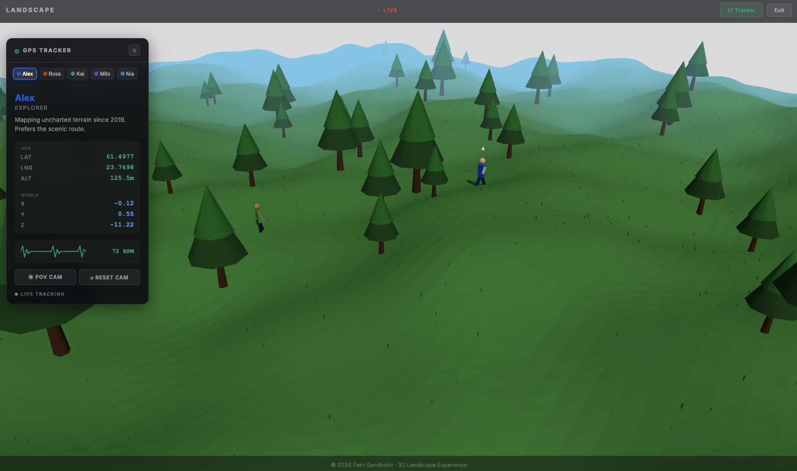

# The Landscape — 3D Interactive Experience



An interactive 3D landscape built with React and Three.js. Five animated characters navigate procedurally generated terrain while you track their journeys through a real-time GPS tracker HUD. Jump into first-person POV mode to see the world through their eyes.

## Live Features

- **Procedural Terrain** — Height-displaced plane geometry with rolling hills, 80 procedurally placed trees, and 5000 instanced grass blades with sway animation
- **Five Unique Characters** — Each with distinct appearance (colors, hats, body scale), walking speed, stride animation, and predefined looping paths across the terrain
- **GPS Tracker HUD** — Draggable panel showing character bios, live GPS coordinates (LAT/LNG/ALT), raw world coordinates (X/Y/Z), animated heartbeat pulse, and live tracking status
- **POV Camera Mode** — First-person view through any character's eyes with smooth following and look-ahead direction
- **Tree & Character Avoidance** — Steering behavior with exponential force falloff, hard collision prevention, and stuck detection with automatic waypoint skipping
- **Atmospheric Sky** — Dynamic sky dome with custom sphere-based clouds that drift across the scene
- **Intro Screen** — Clean entry experience with "Enter World" button that transitions into exploration mode

## Characters

| Name | Role | Style | Speed | BPM |
|------|------|-------|-------|-----|
| **Alex** | Explorer | Blue shirt, no hat | 2.5 | 72 |
| **Rosa** | Hiker | Red shirt, cowboy hat | 2.0 | 65 |
| **Kai** | Jogger | Green shirt, no hat | 3.5 | 142 |
| **Milo** | Wanderer | Purple shirt, yellow beanie | 1.8 | 58 |
| **Zara** | Scout | Teal shirt, blue cap | 2.8 | 95 |

## Tech Stack

- **Vite** — Dev server and build tool
- **React 19** — UI framework
- **React Three Fiber** — React renderer for Three.js
- **Three.js** — 3D graphics engine
- **@react-three/drei** — Utility helpers (OrbitControls, Sky)

## Project Structure

```
src/
├── App.jsx                    # Root component with CharacterProvider
├── main.jsx                   # Entry point
├── index.css                  # Global styles
└── components/
    ├── Scene.jsx              # Canvas, lighting, sky, clouds, fog
    ├── Terrain.jsx            # Ground plane, trees, grass instances
    ├── Overlay.jsx            # Intro screen, top bar, bottom bar
    ├── Overlay.css            # Overlay styles
    ├── TrackerHUD.jsx         # Draggable GPS tracker panel
    ├── TrackerHUD.css         # Tracker styles
    ├── CharacterContext.jsx   # Shared state (selection, positions, POV)
    ├── PersonBase.jsx         # Shared character logic (movement, avoidance)
    ├── Limb.jsx               # Animated arm/leg component
    ├── Hat.jsx                # Hat variants (cowboy, beanie, cap)
    ├── Explorer.jsx           # Alex — blue explorer
    ├── Hiker.jsx              # Rosa — red hiker with cowboy hat
    ├── Jogger.jsx             # Kai — green jogger
    ├── Wanderer.jsx           # Milo — purple wanderer with beanie
    ├── Scout.jsx              # Zara — teal scout with cap
    ├── FollowCamera.jsx       # First-person POV camera
    ├── navigation.js          # Pathfinding, avoidance, collision logic
    ├── paths.js               # Predefined waypoint paths per character
    ├── terrainHeight.js       # Shared terrain height function
    └── worldData.js           # Deterministic tree positions
```

## Getting Started

```bash
# Install dependencies
npm install

# Start dev server (port 3111)
npm run dev

# Build for production
npm run build

# Preview production build
npm run preview
```

## How It Works

### Terrain Generation
The terrain is a 200×200 PlaneGeometry rotated -π/2 around X. Vertex heights are displaced using layered sine/cosine functions. A shared `getTerrainHeight(x, z)` function ensures all objects (characters, trees, grass) sit correctly on the surface.

### Character Navigation
Each character follows a predefined loop of waypoints validated against tree positions. Movement includes:
- **Tree avoidance** — Exponential repulsion force within 5-unit radius
- **Person avoidance** — Characters steer away from each other (3-unit radius)
- **Hard collision** — Movement blocked if destination is inside a tree trunk
- **Stuck detection** — If a character moves less than 0.5 units/sec for 0.8s, it skips to the next waypoint

### GPS Tracker
The HUD converts world coordinates to simulated GPS values:
- LAT: `x × 0.001 + 61.4978` (Tampere, Finland region)
- LNG: `z × 0.001 + 23.7610`
- ALT: `y × 10 + 120` meters

Raw world X/Y/Z coordinates are also displayed for debugging.

### POV Camera
When activated, the camera positions at eye height (2.3 units) slightly behind the selected character and looks 15 units ahead in the character's facing direction. Facing direction is derived from movement deltas with smooth interpolation.

## Controls

- **Mouse drag** — Rotate camera (OrbitControls)
- **Scroll** — Zoom in/out
- **Click character** — Select for tracking
- **Tracker → POV CAM** — Enter first-person view
- **Tracker → RESET CAM** — Return to default view
- **Top bar → Tracker** — Toggle HUD visibility
- **Top bar → Exit** — Return to intro screen

---

© 2026 Petri Sandholm
